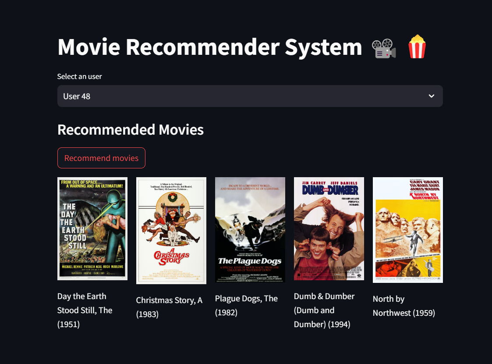

# Movie Recommendation System 📽️

As a part of my project at **Bharat Intern Machine Learning internship**, I developed a Recommendation System with **Collaborative Filtering** to find the similar users, and recommend movies based on it.

To execute the streamlit based movie recommender app, execute the following piece of code after cloning the repository

```python
python -m streamlit run movie_recommender.py
```


## 🚀 About Me
👋 Hi there! I'm **Mainak Mukherjee**, a passionate and ambitious B.Tech student with a strong drive to become a Data Scientist and Data Analyst. Welcome to my data-driven journey!


## Python Libraries used

- numpy
- pandas
- sklearn
- IMDb
- os
- joblib
- warnings


## Authors

- [@Mainakcris7](https://github.com/Mainakcris7)

## Feedback

If you have any feedback, please reach out to me at mainakcr72002@gmail.com